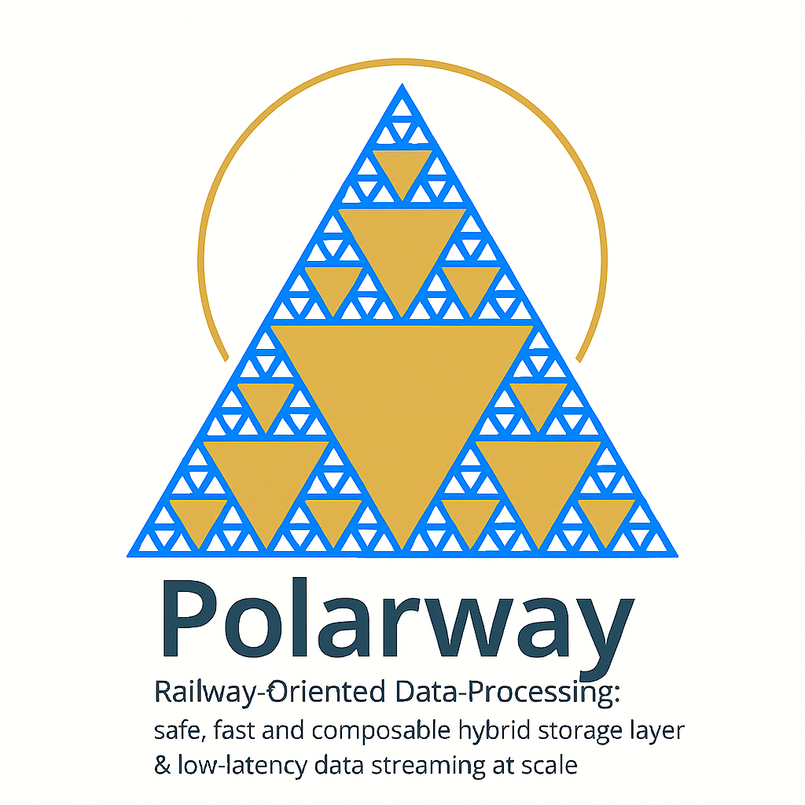

# 🚄 Polarway

<div align="center">



**Railway-Oriented Data Processing: Safe, Fast, and Composable**

[](https://github.com/ThotDjehuty/polarway/releases/tag/v1.0.0)
[](https://opensource.org/licenses/MIT)
[](https://www.rust-lang.org/)
[](https://www.python.org/)
[](https://polarway.readthedocs.io/en/latest/?badge=latest)
[](notebooks/)

[Quick Start](#-quick-start) | [Architecture](#-architecture) | [Documentation](https://polarway.readthedocs.io/) | [Contributing](#-contributing)

</div>

---

## 🎯 What is Polarway?

**Polarway** brings **Railway-Oriented Programming** principles to data engineering: explicit error handling, composable transformations, and safe-by-default operations. Built on [Polars](https://github.com/pola-rs/polars) with **Rust's functional programming elegance** and a **hybrid storage architecture** optimized for modern data workflows.

### Etymology

**Polarway** = **Polar**s + Railway-oriented programming

Inspired by Scott Wlaschin's [Railway-Oriented Programming](https://fsharpforfunandprofit.com/rop/), Polarway treats data pipelines as **railway tracks** where operations either succeed (stay on the success track) or fail (switch to the error track), making error handling **explicit, composable, and type-safe**.

### Why Polarway?

- **🛡️ Railway-Oriented**: Explicit Result/Option types eliminate silent failures
- **🚀 High Performance**: Zero-copy Arrow streaming, zstd compression (18× ratio)
- **🌐 Client-Server**: gRPC architecture for remote execution and multi-client scenarios  
- **💾 Hybrid Storage**: Parquet + DuckDB + LRU Cache (-20% cost vs traditional TSDB)
- **📊 Streaming-First**: Handle 100GB+ datasets on 16GB RAM with constant memory
- **🔄 Composable**: Functors, monads, and lazy evaluation for clean pipelines
- **🔌 Multi-Language**: Python, Rust, Go, TypeScript via gRPC
- **📈 Time-Series Native**: OHLCV resampling, rolling windows, as-of joins

## 🏗️ Architecture

### 🚆 Railway-Oriented Error Handling

Traditional data pipelines hide errors until production. Polarway makes failures **explicit and composable**:

```python
import polarway as pw

# ❌ Traditional approach: Silent failures
try:
    df = load_csv("data.csv")
    filtered = df[df["price"] > 100]
    result = filtered.groupby("symbol").mean()
except Exception as e:
    print(f"Something broke: {e}")  # Where? When? Why?

# ✅ Railway-oriented: Explicit success/failure tracks
pipeline = (
    pw.read_csv("data.csv")
    .and_then(lambda df: df.filter(pw.col("price") > 100))
    .and_then(lambda df: df.group_by("symbol").agg({"price": "mean"}))
    .map_err(lambda e: log_error(e))
)

match pipeline:
    case Ok(result): process_success(result)
    case Err(e): handle_failure(e)  # Clear error path
```

📚 **[Functional Programming Guide →](https://polarway.readthedocs.io/en/latest/functional.html)**

### 💾 Hybrid Storage Layer (v0.53.0)

Three-tier architecture optimized for cost and performance:

1. **Request** arrives
2. → **LRU Cache** (2GB RAM) — Cache Hit (>85%) → Return (~1ms)
3. → Cache Miss → **Parquet** (zstd lvl19, 18× compression) — Load + Warm → Return (~50ms)
4. → **DuckDB** — SQL Analytics → Complex queries (~45ms)

**Results:** -20% cost (24 CHF vs 30 CHF), 18× compression, 85%+ cache hit rate

📚 **[Storage Architecture →](https://polarway.readthedocs.io/en/latest/storage.html)**

### 🏗️ Lakehouse (polarway-lakehouse)

Delta Lake storage layer for ACID transactions, time-travel, and user management:

```rust
use polarway_lakehouse::{DeltaStore, LakehouseConfig};

let store = DeltaStore::new(LakehouseConfig::new("/data/lakehouse")).await?;

// ACID write
store.append("users", user_batch).await?;

// Time-travel: read at version 5
let old = store.read_version("users", 5).await?;

// Time-travel: read at timestamp
let snapshot = store.read_timestamp("users", "2026-02-01T12:00:00Z").await?;

// SQL query with DataFusion
let admins = store.query("users", "role = 'admin'").await?;

// GDPR: permanent deletion + vacuum
store.gdpr_delete_user("user_123").await?;
```

**Features:** Authentication (Argon2 + JWT), audit logging, compaction, Z-ordering, GDPR compliance

📚 **[Lakehouse Guide →](https://polarway.readthedocs.io/en/latest/lakehouse.html)**

### 🌐 Client-Server via gRPC

Handle-based architecture for memory efficiency and multi-client scenarios:

```python
# Client holds handles, server holds data
df = pw.read_parquet("100gb_dataset.parquet")  # Handle: "uuid-123"
filtered = df.filter(pw.col("price") > 100)     # Handle: "uuid-456"

# Only .collect() transfers data
result = filtered.collect()  # Streams Arrow batches via gRPC
```

📚 **[gRPC Architecture →](https://polarway.readthedocs.io/en/latest/architecture.html)**

## 📚 Quick Start

### Installation

```bash
# Start Polarway gRPC server
docker run -d -p 50051:50051 polarway/server:latest

# Or build from source
git clone https://github.com/ThotDjehuty/polarway
cd polarway
cargo build --release -p polarway-grpc
./target/release/polarway-grpc

# Install Python client
pip install polarway
```

### Basic Example

```python
import polarway as pw

# Read with server-side filtering
df = pw.read_parquet(
    "data.parquet",
    columns=["symbol", "price", "timestamp"],
    predicate="price > 100"
)

# Railway-oriented pipeline
result = (
    df
    .and_then(lambda d: d.filter(pw.col("symbol") == "AAPL"))
    .and_then(lambda d: d.group_by("symbol").agg({"price": ["mean", "max"]}))
    .and_then(lambda d: d.collect())
)

match result:
    case Ok(table): print(table)  # pyarrow.Table
    case Err(e): print(f"Pipeline failed: {e}")
```

📚 **[Complete Tutorial →](https://polarway.readthedocs.io/en/latest/quickstart.html)**

### Storage Layer Example

```python
from polarway import StorageClient

# Connect to hybrid storage
client = StorageClient(
    parquet_path="/data/cold",
    enable_cache=True,
    cache_size_gb=2.0
)

# Store with 18× compression
client.store("trades_20260203", df)

# Smart load (cache → Parquet fallback)
df = client.load("trades_20260203")

# SQL analytics via DuckDB
result = client.query("""
    SELECT symbol, AVG(price) as avg_price
    FROM read_parquet('/data/cold/*.parquet')
    WHERE timestamp > '2026-01-01'
    GROUP BY symbol
""")
```

📚 **[Storage Guide →](https://polarway.readthedocs.io/en/latest/storage.html)**

### Time-Series Example

```python
# Load tick data
ticks = pw.read_parquet("btc_ticks.parquet")

# Resample to 5-minute OHLCV bars
ohlcv_5m = (
    ticks
    .as_timeseries("timestamp")
    .resample_ohlcv("5m", price_col="price", volume_col="volume")
)

# Calculate rolling indicators
sma_20 = ohlcv_5m.rolling("20m").agg({"close": "mean"})
returns = ohlcv_5m.pct_change(periods=1)
```

📚 **[Time-Series Guide →](https://polarway.readthedocs.io/en/latest/timeseries.html)**

### Python-Native Streaming (No Server Required)

Polarway's streaming patterns work entirely with **Polars' native engine** and Python async primitives:

```python
import polars as pl
from pathlib import Path

# 1. Larger-than-RAM VWAP on 5M ticks — constant memory
vwap = (
    pl.scan_parquet("ticks/*.parquet")       # lazy — nothing loaded yet
    .filter(pl.col("side") == "BUY")
    .group_by("symbol")
    .agg(
        (pl.col("price") * pl.col("volume")).sum() / pl.col("volume").sum(),
    )
    .collect(engine="streaming")             # chunk-by-chunk, bounded RAM
)

# 2. Per-batch callbacks (spike detection, alerting, forwarding)
def on_batch(batch: pl.DataFrame):
    spikes = batch.filter(pl.col("price").pct_change().abs() > 0.03)
    if len(spikes): alert(spikes)

pl.scan_parquet("ticks/*.parquet").sink_batches(on_batch, chunk_size=200_000)

# 3. Streaming ETL: transform then write without loading into RAM
(
    pl.scan_parquet("raw/*.parquet")
    .with_columns((pl.col("price") * pl.col("volume")).alias("notional"))
    .filter(pl.col("notional") > 5_000)
    .sink_parquet("enriched/output.parquet")  # streaming write
)
```

📓 **[11 streaming patterns → `notebooks/phase5_streaming_test.ipynb`](notebooks/phase5_streaming_test.ipynb)**  
📚 **[Streaming Guide →](https://polarway.readthedocs.io/en/latest/streaming.html)**

## ✨ Key Features

### Railway-Oriented Programming
- ✅ Explicit `Result<T, E>` and `Option<T>` types
- ✅ Composable error handling with `.and_then()`, `.map_err()`
- ✅ Pattern matching for success/failure paths
- ✅ No silent failures or hidden exceptions

### Hybrid Storage (v0.53.0)
- ✅ **ParquetBackend**: zstd level 19 (18× compression)
- ✅ **CacheBackend**: LRU (2GB, 85%+ hit rate)
- ✅ **DuckDBBackend**: SQL analytics on cold data
- ✅ -20% cost vs QuestDB (24 CHF vs 30 CHF)

### Client-Server Architecture
- ✅ Handle-based operations (memory efficient)
- ✅ gRPC streaming (zero-copy Arrow batches)
- ✅ Multi-language clients (Python, Rust, Go, TypeScript)
- ✅ Concurrent operations (10-100× speedup)

### Time-Series Support
- ✅ `TimeSeriesFrame` with frequency awareness
- ✅ OHLCV resampling (tick → 1m → 5m → 1h → 1d)
- ✅ Rolling window aggregations (SMA, EMA, Bollinger)
- ✅ As-of joins for time-aligned data
- ✅ Financial indicators (VWAP, RSI, MACD)

### Streaming & Real-Time Processing
- ✅ `collect(engine='streaming')` — larger-than-RAM datasets, constant memory
- ✅ `sink_batches(fn, chunk_size)` — per-batch callbacks (alerting, forwarding)
- ✅ `sink_parquet / sink_csv / sink_ndjson` — streaming file writes
- ✅ `collect_async()` — concurrent background execution
- ✅ WebSocket ingestion (`websockets`), HTTP polling (`httpx`), `asyncio.Queue`
- ✅ Multi-file partition pruning with predicate pushdown
- ✅ VWAP / OFI / Realized Volatility on sliding windows
- ✅ Sub-millisecond latency via gRPC streaming bridge

## 📊 Performance

| Operation | Polars (PyO3) | Polarway (gRPC) | Notes |
|-----------|---------------|-----------------|-------|
| Read 1GB Parquet | 200ms | 210ms | +5% overhead |
| Filter 10M rows | 50ms | 55ms | +10% overhead |
| GroupBy + Agg | 120ms | 130ms | +8% overhead |
| Stream 100GB | OOM | 12s (8.3M rows/sec) | Polarway advantage |
| Concurrent 100 files | 15s (sequential) | 1.2s (parallel) | 12.5× speedup |

**Network Overhead:** 2-5ms per gRPC request (negligible for analytical queries)

📚 **[Detailed Benchmarks →](https://polarway.readthedocs.io/en/latest/performance.html)**

## 🤝 Contributing

We welcome contributions to Polarway! Check out:

- **[Rust Core](polarway-grpc/)**: gRPC server, storage backends, streaming engine
- **[Python Client](polarway-python/)**: Client library, examples, documentation
- **[Documentation](docs/)**: Tutorials, guides, API reference

### Areas to Contribute

- 🦀 **Rust**: Storage backends, gRPC services, time-series operations
- 🐍 **Python**: Client SDK, examples, Jupyter notebooks
- 📖 **Documentation**: Tutorials, migration guides, architecture docs
- 🧪 **Testing**: Unit tests, integration tests, benchmarks
- 🐛 **Bug Fixes**: See [open issues](https://github.com/ThotDjehuty/polarway/issues)

### Apache Arrow Contributions

Polarway actively contributes to Apache Arrow ecosystem. See [GITHUB_ISSUES_ANALYSIS.md](GITHUB_ISSUES_ANALYSIS.md) for our contribution strategy (13-15 developer-weeks, high ROI).

📚 **[Contributing Guide →](https://polarway.readthedocs.io/en/latest/contributing.html)**

## 📚 Documentation

Complete documentation available at **[polarway.readthedocs.io](https://polarway.readthedocs.io/)**:

- **[Quick Start Guide](https://polarway.readthedocs.io/en/latest/quickstart.html)**: Installation and first pipeline
- **[Railway-Oriented Programming](https://polarway.readthedocs.io/en/latest/functional.html)**: Monads, functors, error handling
- **[Storage Architecture](https://polarway.readthedocs.io/en/latest/storage.html)**: Parquet + DuckDB + Cache
- **[gRPC Architecture](https://polarway.readthedocs.io/en/latest/architecture.html)**: Client-server design
- **[Time-Series Guide](https://polarway.readthedocs.io/en/latest/timeseries.html)**: OHLCV, rolling windows, indicators
- **[Streaming Guide](https://polarway.readthedocs.io/en/latest/streaming.html)**: WebSocket, Kafka, real-time pipelines
- **[API Reference](https://polarway.readthedocs.io/en/latest/api.html)**: Complete Python/Rust APIs
- **[Performance Tuning](https://polarway.readthedocs.io/en/latest/performance.html)**: Benchmarks and optimization tips

## 🛠️ Development

### Project Structure

- **polarway-grpc/** — Rust gRPC server
  - **src/**
    - **service.rs** — gRPC service
    - **handles.rs** — Handle lifecycle
    - **storage/** — Storage backends
  - Cargo.toml
- **polarway-lakehouse/** — Delta Lake storage layer
  - **src/**
    - **store.rs** — DeltaStore (ACID, time-travel, SQL)
    - **auth/** — Authentication (Argon2, JWT)
    - **audit/** — Audit logging (append-only)
    - **maintenance.rs** — Background optimization
  - Cargo.toml
- **polarway-python/** — Python client
  - **polarway/**
    - **\_\_init\_\_.py**
    - **dataframe.py** — DataFrame API
    - **lakehouse.py** — Lakehouse client
    - **storage.py** — Storage client
  - pyproject.toml
- **docs/** — Documentation (MkDocs)
  - index.md
  - lakehouse.md — Lakehouse guide
  - ...
- **proto/** — Protocol buffers
  - polarway.proto

### Build & Test

```bash
# Build Rust server
cargo build --workspace --release

# Run tests
cargo test --workspace

# Start server
cargo run -p polarway-grpc

# Install Python client (dev mode)
cd polarway-python
pip install -e .

# Run Python tests
pytest tests/

# Format
cargo fmt --all && ruff format polarway-python/

# Lint
cargo clippy --workspace -- -D warnings
```

## 🙏 Acknowledgments

Polarway is built on excellent open-source projects:

- **[Polars](https://github.com/pola-rs/polars)**: Fast DataFrame library (original codebase)
- **[Apache Arrow](https://arrow.apache.org/)**: Columnar format and compute kernels
- **[DataFusion](https://datafusion.apache.org/)**: Query optimization engine
- **[Tonic](https://github.com/hyperium/tonic)**: Rust gRPC framework
- **[Tokio](https://tokio.rs/)**: Async runtime for Rust
- **[DuckDB](https://duckdb.org/)**: SQL analytics engine

## 📜 License

Polarway is licensed under the **MIT License** - see [LICENSE](LICENSE) for details.

Original Polars code is also MIT licensed - copyright Ritchie Vink and contributors.

---

<div align="center">

**Built with ❤️ using Rust, gRPC, and Railway-Oriented Programming**

[GitHub](https://github.com/ThotDjehuty/polarway) | [Documentation](https://polarway.readthedocs.io/) | [Issues](https://github.com/ThotDjehuty/polarway/issues)

</div>
