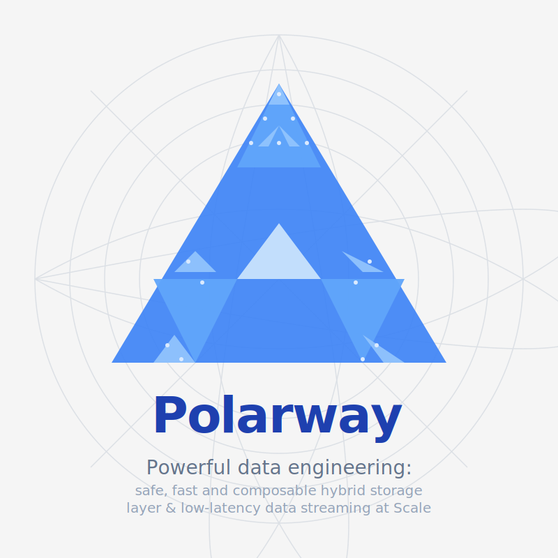

# Polarway Documentation

<div align="center">



**Railway-Oriented Data Processing: Safe, Fast, and Composable**

[Get Started](getting-started.md){ .md-button .md-button--primary }
[View on GitHub](https://github.com/yourusername/polarway){ .md-button }

</div>

---

## What is Polarway?

**Polarway** is a revolutionary data engineering platform that brings **Railway-Oriented Programming** principles to data processing. Built on Polars and Rust, Polarway provides explicit error handling, composable transformations, and a hybrid storage architecture optimized for modern data workflows.

### Key Features

<div class="grid cards" markdown>

- :material-railway: **Railway-Oriented Programming**

    ---

    Explicit `Result<T, E>` types eliminate silent failures. Every error is type-safe and composable.

    [Learn more →](concepts.md#railway-oriented-programming)

- :fontawesome-solid-rocket: **High Performance**

    ---

    Zero-copy Arrow streaming, 18× compression ratio, and constant memory usage for datasets of any size.

    [Learn more →](concepts.md#streaming-operations)

- :material-database: **Hybrid Storage**

    ---

    3-tier architecture: LRU Cache + Parquet + DuckDB. 85% cache hit rate, -20% cost vs traditional TSDB.

    [Learn more →](concepts.md#hybrid-storage-architecture)

- :material-network: **Distributed Mode**

    ---

    gRPC server-client architecture for remote execution. Scale horizontally with multi-language support.

    [Learn more →](distributed-mode.md)

- :material-chart-line: **Time-Series Native**

    ---

    OHLCV resampling, rolling windows, as-of joins. Purpose-built for financial and time-series data.

    [Learn more →](concepts.md#time-series-operations)

- :material-language-python: **Multi-Language**

    ---

    Python, Rust, Go, TypeScript clients. Write once, deploy anywhere.

    [Python](python-client.md) · [Rust](rust-client.md)

</div>

## Quick Start

### Python

```python
import polarway as pw

# Create storage client
client = pw.StorageClient(
    parquet_path="/data/cold",
    enable_cache=True
)

# Railway-Oriented pipeline
result = (
    client.load("trades_20260203")
    .and_then(lambda df: df.filter(pw.col("price") > 100))
    .and_then(lambda df: df.group_by("symbol").agg({"price": "mean"}))
    .map_err(lambda e: f"Pipeline failed: {e}")
)

match result:
    case pw.Ok(data):
        print(f"✅ Success: {len(data)} rows")
    case pw.Err(error):
        print(f"❌ Error: {error}")
```

### Rust

```rust
use polarway::prelude::*;

#[tokio::main]
async fn main() -> Result<()> {
    let storage = HybridStorage::new("/data/cold", ":memory:", 2.0)?;
    
    let result = storage.load("trades_20260203")?
        .lazy()
        .filter(col("price").gt(100))
        .group_by(&["symbol"])
        .agg([col("price").mean()])
        .collect()?;
    
    println!("✅ Success: {:?}", result);
    Ok(())
}
```

[Get Started →](getting-started.md){ .md-button .md-button--primary }

## Architecture

```
┌─────────────────────────────────────────────────────────┐
│                    Application Layer                     │
│              (Python / Rust / Go / TypeScript)           │
└─────────────────────────────────────────────────────────┘
                            ↓
┌─────────────────────────────────────────────────────────┐
│               Polarway Client (Railway-Oriented)         │
│         Result<T, E> · Option<T> · Composable Ops        │
└─────────────────────────────────────────────────────────┘
           ↓                                    ↓
┌──────────────────────┐           ┌──────────────────────┐
│   Standalone Mode    │           │  Distributed Mode    │
│  (Local Storage)     │           │   (gRPC Server)      │
└──────────────────────┘           └──────────────────────┘
           ↓                                    ↓
┌─────────────────────────────────────────────────────────┐
│                   HybridStorage Router                   │
│              (smart_load / smart_store)                  │
└─────────────────────────────────────────────────────────┘
           ↓                 ↓                 ↓
┌──────────────────┐ ┌──────────────┐ ┌─────────────────┐
│  CacheBackend    │ │ ParquetBackend│ │ DuckDBBackend   │
│  (LRU, 2GB RAM)  │ │(18× compress) │ │ (SQL Analytics) │
│  < 1ms           │ │ ~50ms         │ │ ~45ms           │
└──────────────────┘ └──────────────┘ └─────────────────┘
```

## Why Choose Polarway?

| Feature | Polarway | Traditional TSDB | Polars |
|---------|----------|------------------|--------|
| **Error Handling** | Railway-Oriented (explicit) | Exceptions (hidden) | Exceptions (hidden) |
| **Compression** | 18:1 (zstd level 19) | 1.07:1 | N/A (in-memory) |
| **Cache Layer** | Yes (85% hit rate) | Limited | No |
| **Distributed** | gRPC server-client | Limited | No |
| **SQL Support** | Full (DuckDB) | Vendor-specific | Limited |
| **Streaming** | Yes (constant memory) | Limited | Yes |
| **Cost (100GB/mo)** | 24 CHF | 30 CHF | N/A |

## Use Cases

### Financial Markets
- High-frequency trading data storage
- Market data pipelines
- Backtesting engines
- Real-time analytics

### IoT & Sensors
- Time-series sensor data
- Device telemetry
- Event stream processing
- Anomaly detection

### Data Engineering
- ETL pipelines
- Data lakes & warehouses
- Streaming analytics
- Multi-stage transformations

## Performance Characteristics

| Metric | Value |
|--------|-------|
| **Cache hit latency** | < 1ms |
| **Parquet load** | ~50ms |
| **DuckDB query** | ~45ms |
| **Compression ratio** | 18:1 |
| **Cache hit rate** | 85%+ |
| **Memory usage (streaming)** | O(1) constant |
| **Max dataset size** | Unlimited (streaming) |

## Documentation

<div class="grid cards" markdown>

- :fontawesome-solid-play: **[Getting Started](getting-started.md)**

    Quick introduction to Polarway with installation and your first program.

- :material-book-open-variant: **[Core Concepts](concepts.md)**

    Deep dive into Railway-Oriented Programming, Hybrid Storage, and Streaming.

- :material-download: **[Installation](installation.md)**

    Detailed installation instructions for Python, Rust, Docker, and cloud platforms.

- :material-language-python: **[Python Client](python-client.md)**

    Complete Python API guide with StorageClient and Railway-Oriented patterns.

- :material-language-rust: **[Rust Client](rust-client.md)**

    Complete Rust API guide with native performance and type safety.

- :material-network: **[Distributed Mode](distributed-mode.md)**

    Deploy gRPC server for remote execution and horizontal scaling.

- :material-code-braces: **[Examples](examples.md)**

    Real-world examples: market data pipelines, backtesting, streaming.

</div>

## Community

- **GitHub**: [github.com/yourusername/polarway](https://github.com/yourusername/polarway)
- **Discord**: [discord.gg/polarway](https://discord.gg/polarway)
- **Documentation**: [polarway.readthedocs.io](https://polarway.readthedocs.io)
- **Issues**: [github.com/yourusername/polarway/issues](https://github.com/yourusername/polarway/issues)

## License

Polarway is licensed under the [MIT License](https://opensource.org/licenses/MIT).

---

**Ready to get started?** [Install Polarway →](installation.md){ .md-button .md-button--primary }
